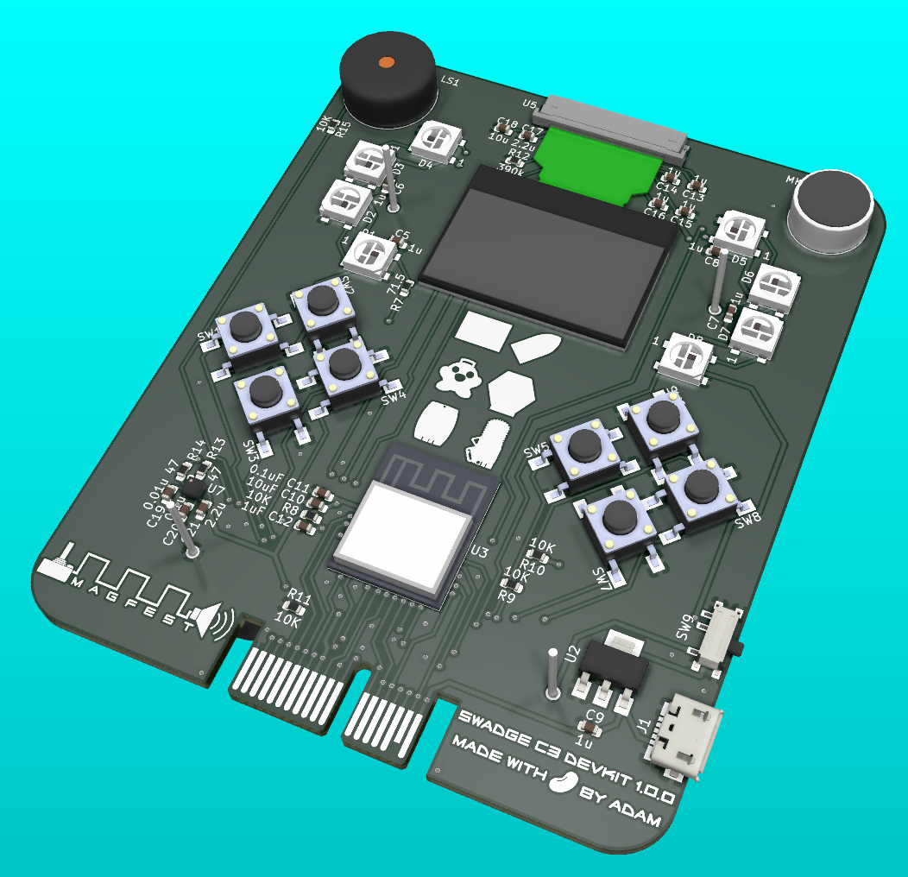
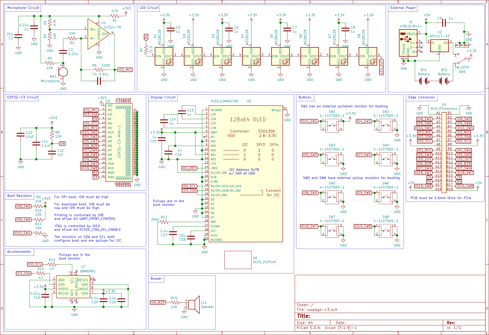

# Swadge-C3-Devkit

It's a Swadge devkit featuring:

* [ESP32-C3-MINI-1](https://www.espressif.com/sites/default/files/documentation/esp32-c3-mini-1_datasheet_en.pdf)
* [QMA6981 Accelerometer](https://datasheet.lcsc.com/szlcsc/QST-QMA6981_C310611.pdf)
* [0.96" 128x64 OLED Display](https://www.buydisplay.com/download/manual/ER-OLED0.96-1_Series_Datasheet.pdf)
* [Microphone](https://www.puiaudio.com/media/SpecSheet/POM-2738P-R.pdf)
* [Piezo Buzzer](https://datasheet.lcsc.com/szlcsc/1808301434_ZLFY-ZL-YDW1207-4005PA-5-0_C219727.pdf)
* 8x [WS2812b LEDs](https://cdn-shop.adafruit.com/datasheets/WS2812B.pdf)
* 8x [Tactile buttons](https://www.te.com/commerce/DocumentDelivery/DDEController?Action=srchrtrv&DocNm=2-1437565-7&DocType=Customer+Drawing&DocLang=Englishe)
* 2x [AA Battery clips](http://www.keyelco.com/product-pdf.cfm?p=1025)
* [Micro USB Power](https://www.molex.com/pdm_docs/sd/473460001_sd.pdf)

It's compatible with the [Swadge Programmer](https://github.com/AEFeinstein/Super-2020-Swadge-HW/tree/master/hardware/swadge-programmer) used for ESP8266 based Swadges, though some GPIOs aren't broken out on the v2 programmer.

# 3D Render

# Schematic

